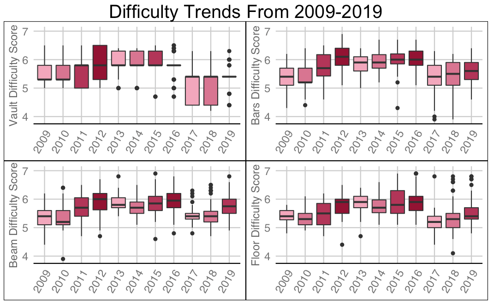

# Elite Gymnastics Scoring Trends

Data Journalism article produced for Bruin Sports Analytics at UCLA. Analyzed scoring trends in 3 separate quads (the four years leading up to each olympics) to detect patterns. Additionally, I analyzed difference in difficulty scoring and execution scoring on each event to understand how a gymnast can optimize their scores.

Final paper: https://www.bruinsportsanalytics.com/post/elite_gymnastics

 

